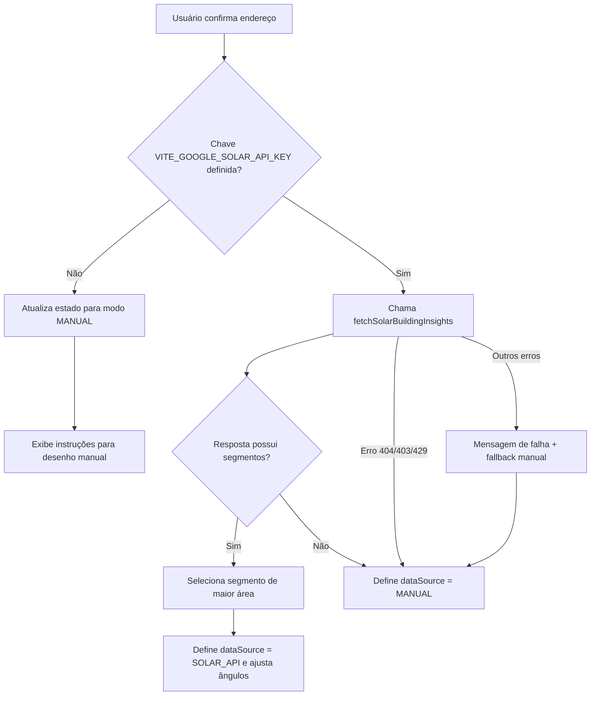
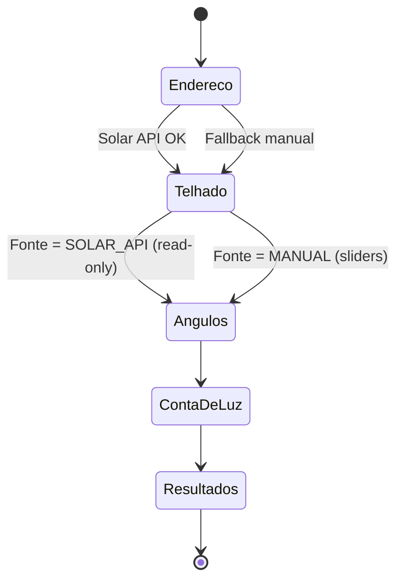

# Fluxos Operacionais do Economia Solar

Este documento complementa o README e o IMPLEMENTATION_DOCUMENT com uma visão visual dos principais fluxos do MVP. Os diagramas a seguir utilizam sintaxe Mermaid compatível com Markdown e focam em como o aplicativo alterna entre os modos **Solar API** e **Manual**, além de como os cálculos de geração são orquestrados.

## 1. Seleção de Fonte de Dados (AddressStep + useSolarData)



- A checagem da chave e atualização do `dataSource` ocorrem em `useSolarData.loadSolarInsights`. 【F:src/hooks/useSolarData.ts†L22-L69】
- A seleção automática do segmento com maior área alimenta `setAngles` e `solarSelection`. 【F:src/hooks/useSolarData.ts†L34-L50】
- Falhas ou ausência de segmentos levam ao modo manual com `manualOverride`. 【F:src/hooks/useSolarData.ts†L51-L69】

## 2. Fluxo de Navegação por Etapas



- O `AppStateContext` controla `currentStepIndex` e os estados compartilhados entre etapas. 【F:src/context/AppStateContext.tsx†L16-L114】
- Cada componente em `src/components/steps` consome esse contexto para renderizar comportamentos específicos por fonte. 【F:src/components/steps/RoofSelectStep.tsx†L1-L160】【F:src/components/steps/TiltAzimuthStep.tsx†L1-L160】

## 3. Pipeline de Cálculo (useSolarCalc)

```mermaid
flowchart LR
  Start[Botão Calcular] --> S{Fonte de dados}
  S -- SOLAR_API --> CheckSegment{Segmento selecionado?}
  CheckSegment -- Não --> Err1[Mensagem: selecione segmento]
  CheckSegment -- Sim --> HasEnergy{Segmento possui energia mensal/ anual?}
  HasEnergy -- Não --> FetchNASA[Busca NASA POWER]
  HasEnergy -- Sim --> FetchNASAOpt[Busca NASA para complementar (tolerante a falhas)]
  FetchNASA --> SolarCompute[performSolarSegmentComputation]
  FetchNASAOpt --> SolarCompute
  S -- MANUAL --> RoofCheck{Telhado desenhado?}
  RoofCheck -- Não --> Err2[Mensagem: desenhe polígono]
  RoofCheck -- Sim --> FetchNASAManual[Busca NASA POWER]
  FetchNASAManual --> ManualCompute[performManualComputation]
  SolarCompute --> SetResults[Atualiza resumo + meses]
  ManualCompute --> SetResults
  SetResults --> Finish[Exibe Resultados]
```

- O fluxo inicia apenas se `place` e `monthlySpendBRL` forem válidos. 【F:src/hooks/useSolarCalc.ts†L18-L34】
- Quando um segmento Solar API é escolhido, o hook decide se precisa complementar com NASA POWER antes de chamar `performSolarSegmentComputation`. 【F:src/hooks/useSolarCalc.ts†L40-L74】
- No modo manual, a ausência de polígono força o usuário a voltar; caso exista, busca NASA POWER e chama `performManualComputation`. 【F:src/hooks/useSolarCalc.ts†L75-L98】
- Em ambos os casos o resultado é aplicado com `setResults`, limpando erros de NASA. 【F:src/hooks/useSolarCalc.ts†L99-L114】

## 4. Tratamento de Erros e Reset de Resultados

```mermaid
flowchart TD
  LoadAddress[loadSolarInsights] --> ClearRes[clearResults()]
  ClearRes --> StatusLoading[solarStatus = loading]
  StatusLoading --> Success[Atualiza insights e status success]
  StatusLoading --> Failure{Erro?}
  Failure -- 404/Quota --> ManualFallback
  Failure -- Outros --> ManualFallback
  ManualFallback --> StatusError[solarStatus = error]
  StatusError --> Notify[UI exibe alerta e modo manual]
```

- Toda nova tentativa limpa resultados anteriores (`clearResults`) para evitar inconsistências entre etapas. 【F:src/hooks/useSolarData.ts†L24-L27】
- `solarStatus` e `solarError` coordenam mensagens para o usuário quando a Solar API falha. 【F:src/context/AppStateContext.tsx†L68-L82】【F:src/hooks/useSolarData.ts†L55-L69】
- O cálculo também captura exceções e apresenta `nasaError`, o que mantém feedbacks consistentes no `ResultsStep`. 【F:src/hooks/useSolarCalc.ts†L18-L114】

## 5. Uso dos Diagramas

- Abra o arquivo em qualquer visualizador Markdown com suporte a Mermaid (VS Code, GitHub ou MkDocs com plugin).
- Os diagramas servem como guia rápido para onboarding da equipe, revisão de requisitos e identificação de pontos de falha.
- Atualize-os sempre que a ordem de etapas, fontes de dados ou políticas de fallback mudarem.

> **Dica:** combine estes fluxos com a visão geral do `IMPLEMENTATION_DOCUMENT.md` para ter uma documentação completa do MVP.
